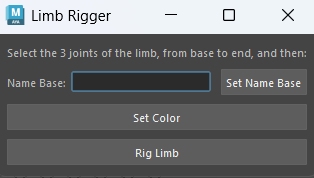

# Maya Rigging Tools
-------------------------------------------------
## How To Install
Drag *install.mel* into the Maya viewport, and click on the resulting shelf button.
## Tech Stack
|Tool | Version|
|-|-|
|Python|3.12|
|Pyside|6|
|Maya|2025 and above|

-------------------------------------------------

## Limb Rigger

* Rig arms and legs with IKFK blend & custom control colors